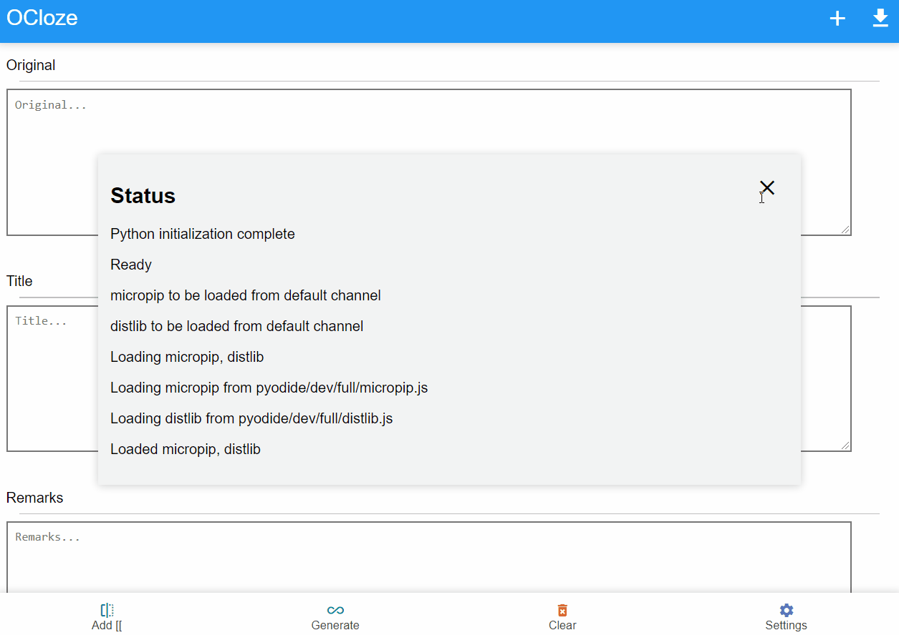
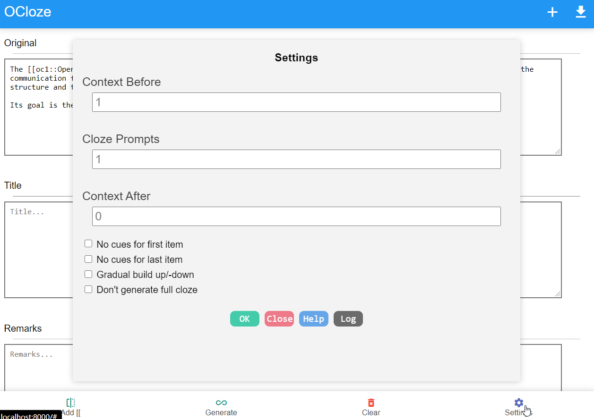

# ocloze
cloze overlapper in browser for Anki, AnkiMobile and AnkiDroid

It is web app for original [cloze overlapper addon by Glutanimate](https://github.com/glutanimate/cloze-overlapper).

# Quick Start

Visit following in browser

https://krmanik.github.io/ocloze/index.html

### For iOS this can be used as Addons
https://github.com/krmanik/AnkiMobile-Addons/tree/main/ocloze

# Features
- Create cloze with text selection
- Auto generate cloze for list items
- Generate ready to import Anki Decks
- Settings for context before, context after and cloze prompts

# Disclaimer
### Version 2
The version 2 of the project developed using [genanki-js](https://github.com/krmanik/genanki-js) javaScript library. It creates ready to import decks. The python code of [cloze overlapper](https://github.com/glutanimate/cloze-overlapper) converted to javascript code.

### Version 1 (Deprecated)
The project made using HTML/CSS/JS, pyodide and genanki python module.

The web app use existing ```generator.py``` and ```overlapper.py``` python code developed by [Glutanimate](https://github.com/glutanimate/cloze-overlapper). The web app only generate cloze and export Anki decks. But for reviewing in order you may have to get the original addon from [Glutanimate's Patreon](https://www.patreon.com/glutanimate). The original addon have more features for scheduling of cards in Anki.
<br>[Click here to support Glutanimate's work](https://glutanimate.com/support-my-work/)

# How to create cloze?
## Create cloze in paragraph
1. Paste paragraph in ```Original``` field
2. Select a text in paragraph
3. Click ```Add [[``` button to create cloze for that text
4. Repeat 1-3 to add more cloze
5. Click ```Generate``` button to generate cloze
6. Click ```Add``` button to add generated cloze to list
7. Repeat to create more cloze
8. Finally, Click download button to export deck

## Auto generate cloze for list items
1. Paste list with item per line in ```Original``` field
2. Click ```Generate``` button to generate cloze
3. Click ```Add``` button to add generated cloze to list
4. Repeat 1-3 to create more cloze
5. Click download button to export deck

# Demo


# Available settings


# License
View [License.md](License.md)